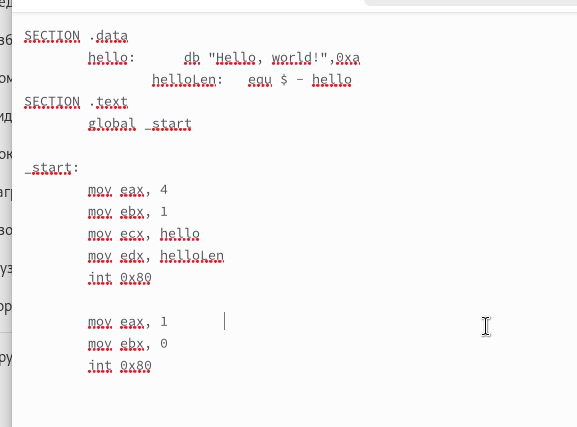
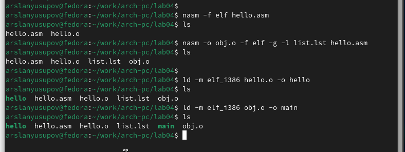

---
## Front matter
title: "Отчёт по лабораторной работе 4"
subtitle: "Архитектура компьютера"
author: "Арслан Юсупов"

## Generic otions
lang: ru-RU
toc-title: "Содержание"

## Bibliography
bibliography: bib/cite.bib
csl: pandoc/csl/gost-r-7-0-5-2008-numeric.csl

## Pdf output format
toc: true # Table of contents
toc-depth: 2
lof: true # List of figures
lot: true # List of tables
fontsize: 12pt
linestretch: 1.5
papersize: a4
documentclass: scrreprt
## I18n polyglossia
polyglossia-lang:
  name: russian
  options:
	- spelling=modern
	- babelshorthands=true
polyglossia-otherlangs:
  name: english
## I18n babel
babel-lang: russian
babel-otherlangs: english
## Fonts
mainfont: PT Serif
romanfont: PT Serif
sansfont: PT Sans
monofont: PT Mono
mainfontoptions: Ligatures=TeX
romanfontoptions: Ligatures=TeX
sansfontoptions: Ligatures=TeX,Scale=MatchLowercase
monofontoptions: Scale=MatchLowercase,Scale=0.9
## Biblatex
biblatex: true
biblio-style: "gost-numeric"
biblatexoptions:
  - parentracker=true
  - backend=biber
  - hyperref=auto
  - language=auto
  - autolang=other*
  - citestyle=gost-numeric
## Pandoc-crossref LaTeX customization
figureTitle: "Рис."
tableTitle: "Таблица"
listingTitle: "Листинг"
lofTitle: "Список иллюстраций"
lotTitle: "Список таблиц"
lolTitle: "Листинги"
## Misc options
indent: true
header-includes:
  - \usepackage{indentfirst}
  - \usepackage{float} # keep figures where there are in the text
  - \floatplacement{figure}{H} # keep figures where there are in the text
---

# Цель работы

Целью работы является освоение процедуры компиляции и сборки программ, написанных на ассемблере NASM.

# Выполнение лабораторной работы

## Программа Hello world!

Создал каталог lab04 командой mkdir, перешел в него с помощью команды cd и создал файл hello.asm, в который напишу программу.
Убеждаюсь с помощью команды ls, что создал файл.

{ #fig:001 width=70%, height=70% }

Написал программу по заданию на языке ассемблера.

{ #fig:002 width=70%, height=70% }

## Транслятор NASM

NASM превращает текст программы в объектный код. Если текст программы набран без ошибок, то транслятор преобразует текст программы из файла hello.asm в объектный код, который запишется в файл hello.o. 

Транслировал файл командой nasm. Получился объектный файл hello.o.

{ #fig:003 width=70%, height=70% }

## Расширенный синтаксис командной строки NASM

Полный вариант командной строки nasm выглядит следующим образом: 

```nasm [-@ косвенный_файл_настроек] [-o объектный_файл] [-f формат_объектного_файла] [-l листинг] [параметры...] [--] исходный_файл```

Транслировал файл командой nasm с дополнительными опциями. 
С опцией -l Получил файл листинга list.lst, с опцией -f объектный файл obj.o, с опцией -g в программу добавилась отладочная информация.

{ #fig:004 width=70%, height=70% }

## Компоновщик LD

Чтобы получить исполняемую программу, объектный файл необходимо передать на обработку компоновщику.

Выполнил команду ld и получил исполняемый файл hello из объектного файла hello.o.

{ #fig:005 width=70%, height=70% }

Еще раз выполнил команду ld для объектного файла obj.o и получил исполняемый файл main.

{ #fig:006 width=70%, height=70% }

## Запуск исполняемого файла

Запустил исполняемые файлы.

{ #fig:007 width=70%, height=70% }

## Задание для самостоятельной работы

Скопировал файл hello.asm в файл lab4.asm.

{ #fig:008 width=70%, height=70% }

Изменил сообщение Hello world на свое имя.

{ #fig:009 width=70%, height=70% }

Запустил программу и проверил.

{ #fig:010 width=70%, height=70% }

# Выводы

Освоил процесс компиляции и сборки программ, написанных на ассемблере nasm.